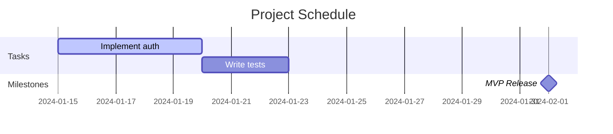
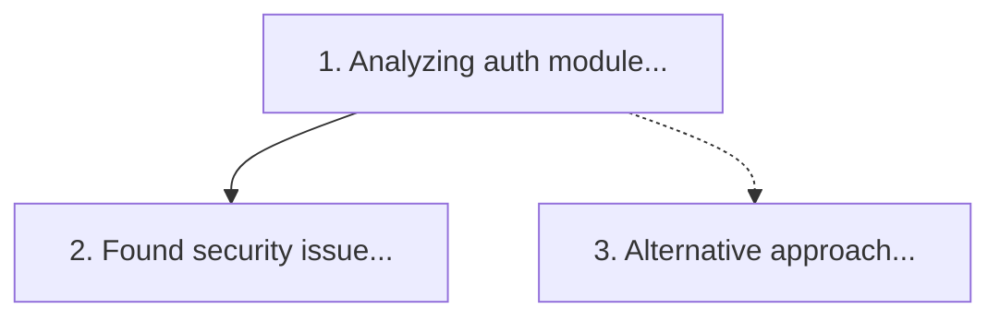
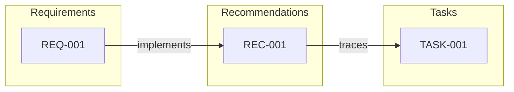
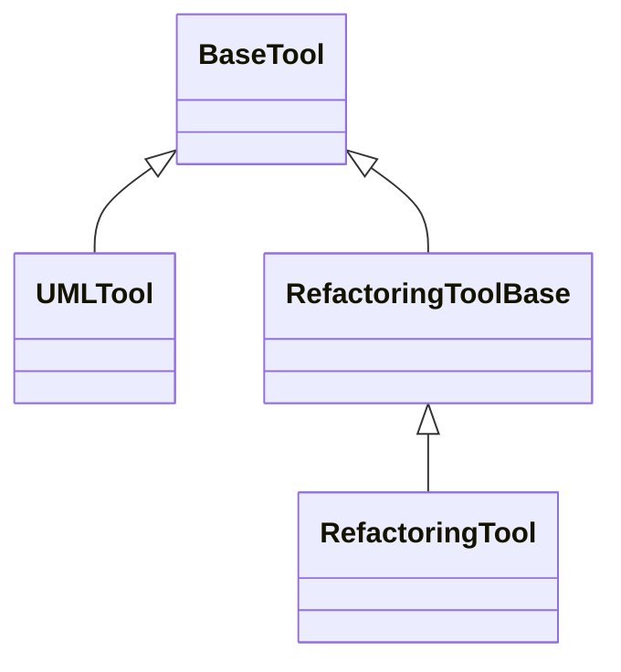
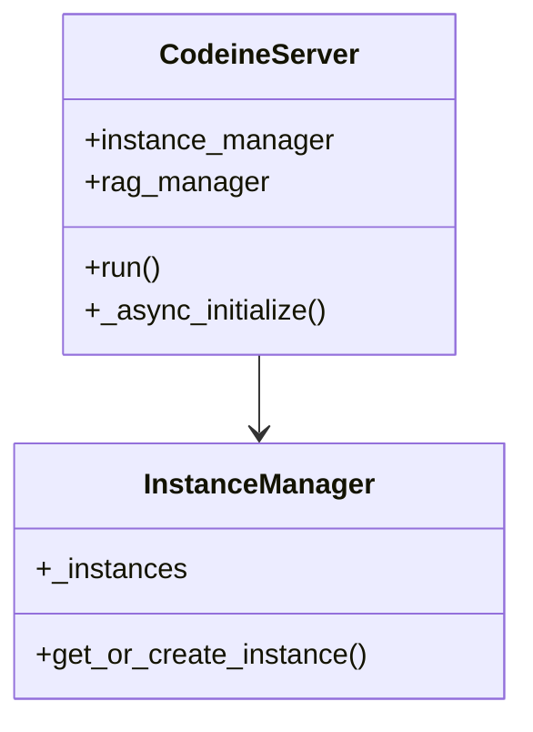
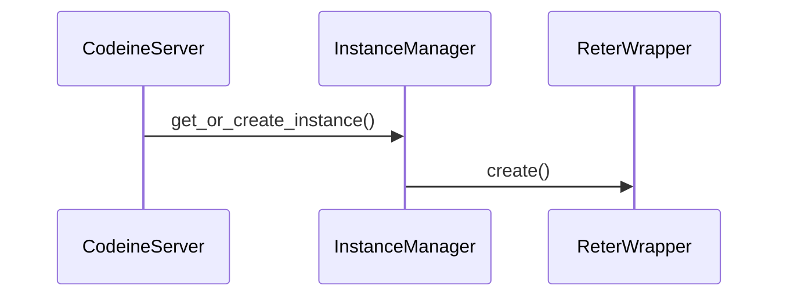
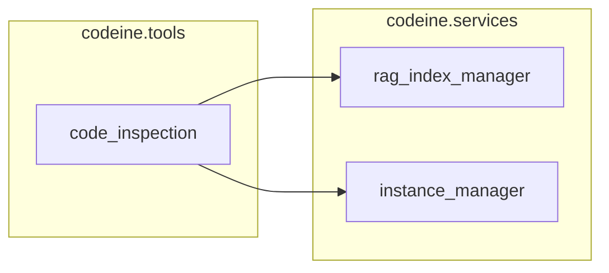
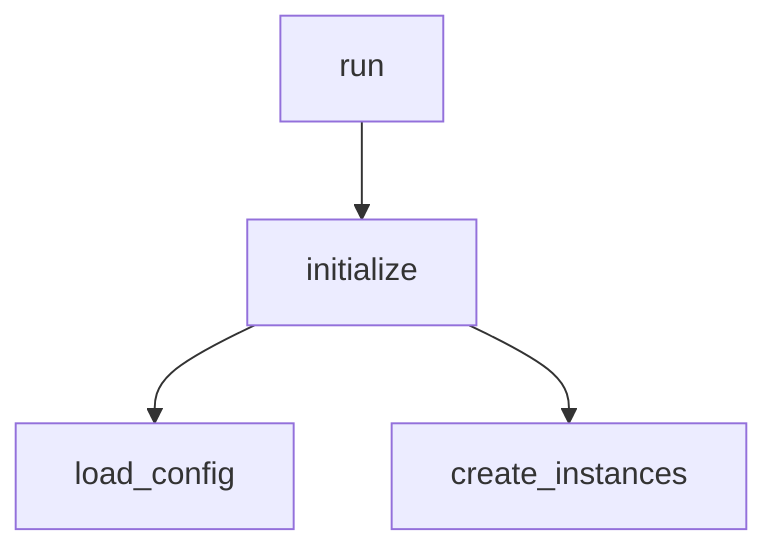

# diagram Tool

Generate diagrams and visualizations for code and project analysis.

## Overview

The `diagram` tool generates various diagram types in Mermaid, Markdown, or JSON format. It supports both session/project diagrams and UML/code diagrams.

## Basic Usage

```python
# Generate class hierarchy
diagram(diagram_type="class_hierarchy", target="BaseTool")

# Generate Gantt chart
diagram(diagram_type="gantt")
```

## Parameters

| Parameter | Type | Default | Description |
|-----------|------|---------|-------------|
| `diagram_type` | str | required | Type of diagram to generate |
| `instance_name` | str | "default" | Session/RETER instance name |
| `format` | str | "mermaid" | Output format: mermaid, markdown, json |
| `root_id` | str | None | Root item ID for tree diagrams |
| `start_date` | str | None | Start date filter for gantt |
| `end_date` | str | None | End date filter for gantt |
| `target` | str | None | Target entity for UML diagrams |
| `classes` | list | None | Class names for class/sequence/coupling diagrams |
| `include_methods` | bool | True | Include methods in class diagrams |
| `include_attributes` | bool | True | Include attributes in class diagrams |
| `max_depth` | int | 10 | Max depth for sequence/call_graph |
| `show_external` | bool | False | Show external deps in dependency diagram |
| `params` | dict | None | Additional diagram-specific parameters |

## Session/Project Diagrams

### gantt

Generate a Gantt chart for tasks and milestones.

```python
diagram(
    diagram_type="gantt",
    start_date="2024-01-01",
    end_date="2024-03-31"
)
```

Output (Mermaid):


### thought_chain

Generate a reasoning chain diagram with branches.

```python
diagram(diagram_type="thought_chain")
```

Output (Mermaid):


### traceability

Generate a requirements traceability matrix.

```python
diagram(diagram_type="traceability", format="mermaid")
```

Output (Mermaid):


### requirements

Generate a requirement hierarchy diagram.

```python
diagram(diagram_type="requirements", root_id="REQ-001")
```

## UML/Code Diagrams

### class_hierarchy

Generate class inheritance hierarchy.

```python
diagram(
    diagram_type="class_hierarchy",
    target="BaseTool"  # Optional root class
)
```

Output (Mermaid):


### class_diagram

Generate class diagram with methods and attributes.

```python
diagram(
    diagram_type="class_diagram",
    classes=["CodeineServer", "InstanceManager"],
    include_methods=True,
    include_attributes=True
)
```

Output (Mermaid):


### sequence

Generate sequence diagram of method calls.

```python
diagram(
    diagram_type="sequence",
    classes=["CodeineServer", "InstanceManager", "ReterWrapper"],
    target="run",  # Entry point
    max_depth=5
)
```

Output (Mermaid):


### dependencies

Generate module dependency graph.

```python
diagram(
    diagram_type="dependencies",
    show_external=False,
    params={
        "group_by_package": True,
        "highlight_circular": True
    }
)
```

Output (Mermaid):


### call_graph

Generate call graph from an entry point.

```python
diagram(
    diagram_type="call_graph",
    target="initialize",  # Focus function
    max_depth=3,
    params={"direction": "both"}  # both, callers, callees
)
```

Output (Mermaid):


### coupling

Generate coupling/cohesion matrix.

```python
diagram(
    diagram_type="coupling",
    classes=["ClassA", "ClassB", "ClassC"],
    params={
        "max_classes": 20,
        "threshold": 0.1,
        "include_inheritance": True
    }
)
```

Output (Markdown):
```
| Class | ClassA | ClassB | ClassC |
|-------|--------|--------|--------|
| ClassA | 1.0 | 0.3 | 0.1 |
| ClassB | 0.3 | 1.0 | 0.5 |
| ClassC | 0.1 | 0.5 | 1.0 |
```

## Output Formats

| Format | Description |
|--------|-------------|
| `mermaid` | Mermaid diagram syntax (default) |
| `markdown` | Markdown tables/text |
| `json` | Structured JSON data |

## Requirements

- Session diagrams: Requires SQLite component
- UML diagrams: Requires RETER component
